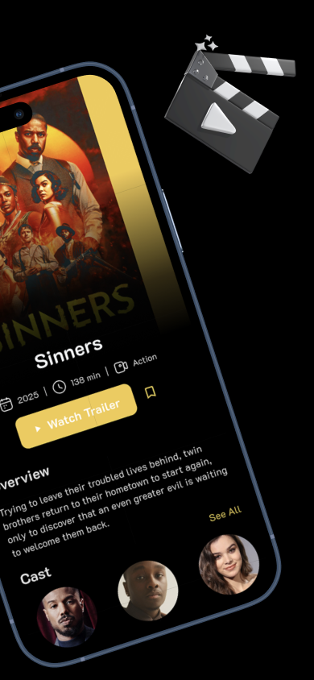
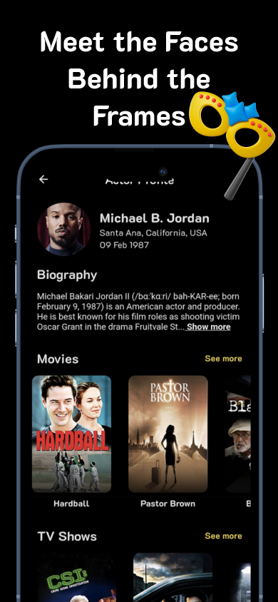
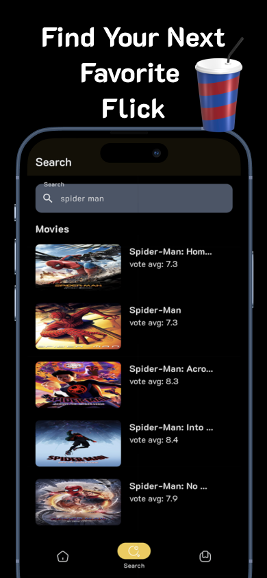
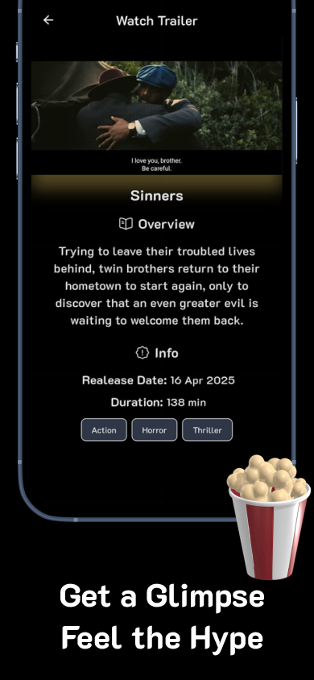
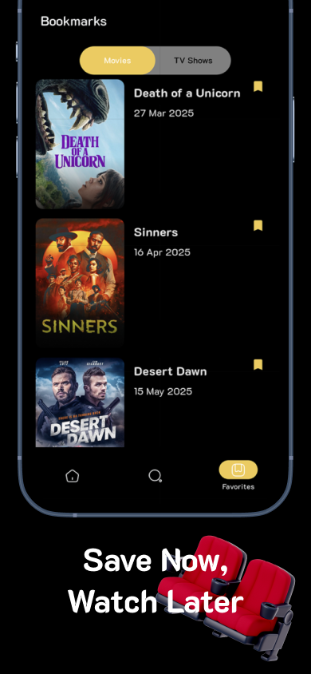

# CineX

A modern Movies application built with Flutter and GetX for state management, routing, and dependency injection.

## Screenshots

<div align="center">
  
  
  
  
  
  
  
</div>

## Features

- Real-time movie/TV show information
- Search functionality for movies, TV shows, and actors
- Trending now section for the most popular movies and shows
- Detailed movie/show info (overview, cast, crew, genre,)
- Trailer viewing with video player support
- Personalized watchlist for saving movies and shows to watch later
- Dark/Light theme support for better user experience
- Modern and minimal UI for easy navigation 
- Error handling for smooth user experience (e.g., no results found, connection issues)

## Setup

1. Clone the repository
2. Install dependencies:
   ```bash
   flutter pub get
   ```
3. Create a `.env` file in the root directory and add your weatherapi API key from https://developer.themoviedb.org/:
   ```
   TMDB_API_KEY = your_api_key_here
   ```
4. Run the app:
   ```bash
   flutter run
   ```

## Dependencies

- get: ^4.6.6 - State management, routing, and dependency injection
- intl: ^0.19.0 - Date formatting
- flutter_dotenv: ^5.1.0 - Environment variables
- dio: ^5.8.0+1 - HTTP client
- flutter_localizations: SDK - Internationalization support
- get_storage: ^2.1.1 - Local storage
- flutter_lints: ^5.0.0 - Code linting
- youtube_player_iframe: ^5.2.1 - youtube player using web view
- carousel_slider: ^5.0.0 - 
- iconsax: ^0.0.8 - modern icons

## Project Structure

```
lib/
├── app/
│   ├── constants/ - Utility constants
│   ├── controllers/ - Business logic and state management
│   ├── data/ - Data models and repositories
│   ├── helpers/ - Helper functions and utilities
│   ├── routes/ - Navigation and routing configuration
│   ├── services/ - API and external service integrations
│   ├── theme/ - App theming and styling
│   └── views/ - UI components and screens
├── generated/ - Generated localization files
├── l10n/ - Localization configuration
├── bottom_navigation.dart - App root
├── main.dart - Application entry point
└── my_app.dart - Root widget configuration
```

## Getting an API Key

1. Go to [TMDB api](https://developer.themoviedb.org/)
2. Sign up for a free account
3. Apply for a API key
4. Add it to the `.env` file

## License

MIT License
